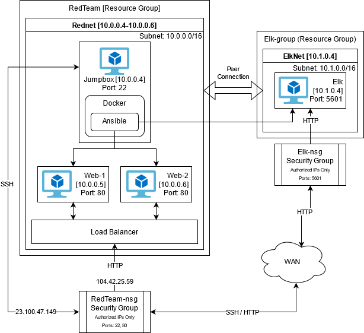
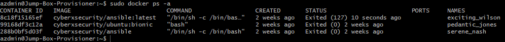

## Automated ELK Stack Deployment

The files in this repository were used to configure the network depicted below.

These files have been tested and used to generate a live ELK deployment on Azure. They can be used to either recreate the entire deployment pictured above. Alternatively, select portions of the YAML file may be used to install only certain pieces of it, such as Filebeat.

  - 
  - 

This document contains the following details:
- Description of the Topologu
- Access Policies
- ELK Configuration
  - Beats in Use
  - Machines Being Monitored
- How to Use the Ansible Build

## Description of the Topology

The main purpose of this network is to expose a load-balanced and monitored instance of DVWA, the D*mn Vulnerable Web Application.

Load balancing ensures that the application will be highly accessible, in addition to restricting access to the network.
- Load balancers protect from DDoS attacks as well as allow for web server redundancy.
- Jump box'es allow access to servers on a network without leaving them open to possible attack from external sources.

Integrating an ELK server allows users to easily monitor the vulnerable VMs for changes to the files and system files.
- Filebeat allows us to monitor the logs from the specified servers. 
- Metricbeats logs usage of server resources and telemetry.

The configuration details of each machine may be found below.

| Name     | Function | IP Address | Operating System |
|----------|----------|------------|------------------|
| Jump Box | Gateway  | 10.0.0.4   | Linux            |
| Web-1    | Web Server | 10.0.0.5 | Linux            |
| Web-2    | Web Server | 10.0.0.6 | Linux            |
| Elk      | Elk Server | 10.1.0.4 | Linux            |

## Access Policies

The machines on the internal network are not exposed to the public Internet. 

Only the Jumpbox machine can accept connections from the Internet. Access to this machine is only allowed from the following IP addresses:
- 75.164.84.48

Machines within the network can only be accessed by Jumpbox.
- Web-1 [10.0.0.5]
- Web-2 [10.0.0.6]
- Elk [10.1.0.4]

A summary of the access policies in place can be found in the table below.

| Name     | Publicly Accessible | Allowed IP Addresses |
|----------|---------------------|----------------------|
| Jump Box | Yes                 | 75.164.84.48         |
| Web-1    | Yes                 | 75.164.84.48 10.0.0.4|
| Web-2    | Yes                 | 75.164.84.48 10.0.0.4|
| Elk      | Yes                 | 75.164.84.48 10.0.0.4|

## Elk Configuration

Ansible was used to automate configuration of the ELK machine. No configuration was performed manually, which is advantageous because...
- Less time to configure
- Configuration can be done remotely
- Configuration can be done on muntiple servers at once

The playbook implements the following tasks:
- Install Docker and Python
- Install Docker Module using python
- Increase Virtual Memory Size
- Download and launch docker elk container
- Enable docker service on boot

The following screenshot displays the result of running `docker ps` after successfully configuring the ELK instance.

## Target Machines & Beats
This ELK server is configured to monitor the following machines:
- Web-1 	Web Server	10.0.0.5		Linux
- Web-2		Web Server	10.0.0.6		Linux

We have installed the following Beats on these machines:
- Filebeat
- Metricbeat

These Beats allow us to collect the following information from each machine:
- Filebeat allows us to monitor the logs from the specified servers. 
- Metricbeats logs usage of server resources and telemetry.

## Using the Playbook
In order to use the playbook, you will need to have an Ansible control node already configured. Assuming you have such a control node provisioned: 

SSH into the control node and follow the steps below:
- The YAML file is the playbook, and should be copied to the server which is running it.
- Update the Hosts File to include the servers you wish to configure.
- Run the playbook, and navigate to http://localhost:5601/ to check that the installation worked as expected.

